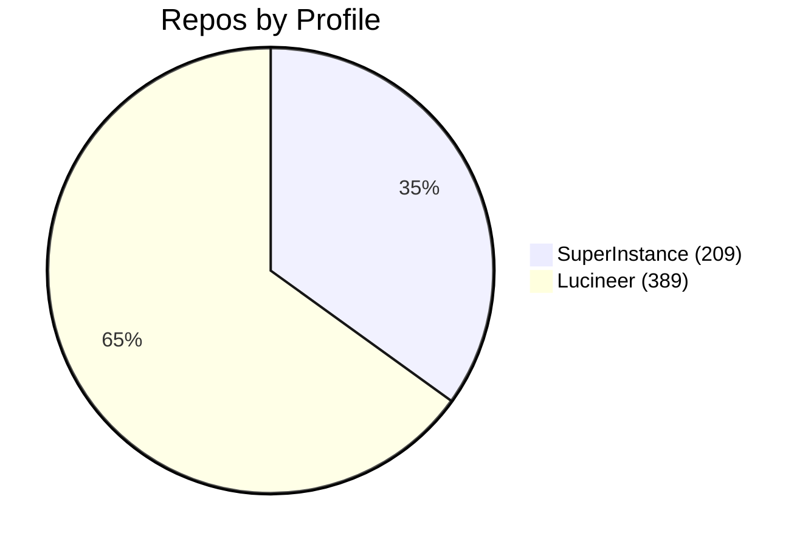

# 🔮 SuperInstance Index

> A complete map of the **SuperInstance** and **Lucineer** ecosystems.
> **598 repositories** across two GitHub profiles.

## Architecture Overview

```mermaid
graph TB
    subgraph SuperInstance
        SI_EQ[Equipment]
        SI_SP[Spreadsheet Paradigm]
        SI_FLUX[FLUX Runtime]
        SI_CT[Constraint Theory]
        SI_AG[Agent Frameworks]
        SI_ML[AI & ML]
        SI_INFRA[Infrastructure]
        SI_COCAPN[Cocapn]
        SI_APPS[Log Apps]
        SI_GAME[Games]
        SI_LANG[Languages]
        SI_SEC[Security]
        SI_SDK[SDK & Characters]
        SI_FISH[Marine & Fishing]
        SI_MEM[Memory & Learning]
        SI_RES[Research]
    end

    subgraph Lucineer
        L_CUDA[CUDA Core]
        L_FLEET[Fleet]
        L_NEXUS[Nexus]
        L_CRAFT[CraftMind]
        L_A2A[A2A Protocol]
        L_COCAPN[Cocapn]
        L_GIT[Git Agents]
        L_CTX[Context Management]
        L_TRUST[Trust & Governance]
        L_AGENT[Agent Behavior]
        L_SWARM[Swarm Intelligence]
        L_CONSENSUS[Consensus]
        L_DECK[DeckBoss]
        L_APPS[AI Apps]
        L_EDGE[Edge & Hardware]
    end

    SI_COCAPN <--> L_COCAPN
    SI_AG <--> L_A2A
    SI_EQ <--> L_AGENT
    SI_FISH <--> L_EDGE
    L_CUDA --> L_FLEET
    L_CUDA --> L_NEXUS
    L_FLEET --> L_CRAFT
```

## 📊 SuperInstance ([github.com/SuperInstance](https://github.com/SuperInstance))

**209 repositories** — Casey Digennaro

| Category | Count | Description |
|----------|-------|-------------|
| [Agent Frameworks](./SuperInstance/agent-frameworks/) | 15 | Multi-agent coordination, orchestration, and lifecycle management |
| [AI & ML](./SuperInstance/ai-ml/) | 16 | Inference, embeddings, vector search, RAG, JEPA, sentiment analysis, and token optimization |
| [Constraint Theory](./SuperInstance/constraint-theory/) | 9 | Deterministic geometric snapping, Pythagorean coordinates, and first-person-shooter perspectives for agents |
| [Creative](./SuperInstance/creative/) | 1 | AI writings and creative experiments |
| [Equipment](./SuperInstance/equipment/) | 11 | Modular equipment system — memory, escalation, swarm coordination, self-improvement, and more |
| [FLUX](./SuperInstance/flux/) | 3 | Fluid Language Universal eXecution — self-assembling runtime, bytecode VM, and agent-first code |
| [Games](./SuperInstance/games/) | 4 | Minecraft AI foremen, game dev experiments |
| [Infrastructure](./SuperInstance/infrastructure/) | 15 | Caching, distributed locks, tracing, deployment, task queues, and rate limiting |
| [Log Apps](./SuperInstance/log-apps/) | 9 | PersonalLog, BusinessLog, StudyLog, MakerLog, and other log.ai apps |
| [Memory & Learning](./SuperInstance/memory-learning/) | 12 | Hierarchical memory, bandit algorithms, knowledge tensors, and reinforcement learning |
| [Other](./SuperInstance/other/) | 83 | Miscellaneous and uncategorized |
| [Research & Papers](./SuperInstance/research/) | 2 | CRDT research, whitepapers, and mathematical foundations |
| [SDK & Characters](./SuperInstance/sdk-characters/) | 7 | AI Character SDK, skill trees, superpowers, and starter agents |
| [Spreadsheet Paradigm](./SuperInstance/spreadsheet-paradigm/) | 14 | Tile intelligence in real-time spreadsheets. Claw agents monitoring cells. The SuperInstance visual metaphor. |
| [Web & UI](./SuperInstance/web-ui/) | 8 | Frontend, dashboards, Cloudflare integrations, browser tools |

## 🧬 Lucineer ([github.com/Lucineer](https://github.com/Lucineer))

**389 repositories** — Lucineer

| Category | Count | Description |
|----------|-------|-------------|
| [A2A Protocol](./Lucineer/a2a-protocol/) | 3 | Agent-to-Agent protocol — discovery, negotiation, coordination, and robotics extensions |
| [Agent Behavior](./Lucineer/agent-behavior/) | 17 | DNA, evaluations, generations, identity, rhythm, therapy, and vocabulary |
| [AI Apps](./Lucineer/ai-apps/) | 9 | Domain-specific AI applications — health, food, travel, pets, and more |
| [Causal Reasoning](./Lucineer/causal/) | 3 | Causal graphs, healing, and memory for failure diagnosis |
| [Cocapn](./Lucineer/cocapn/) | 9 | Repo-first agent infrastructure — the repo IS the agent |
| [Consensus](./Lucineer/consensus/) | 5 | Tripartite, resonant consensus, confidence cascades, and deliberation |
| [Constraint Theory](./Lucineer/constraint-theory/) | 2 | Deterministic geometric snapping, Pythagorean coordinates, and first-person-shooter perspectives for agents |
| [Context Management](./Lucineer/context-management/) | 7 | Brokers, compactors, lattices, limits, recyclers, and serializers for fleet context |
| [CraftMind](./Lucineer/craftmind/) | 9 | Minecraft AI — fishing, herding, ranch, circuits, studio, and education |
| [CUDA Core (Lucineer)](./Lucineer/cuda-core/) | 41 | Rust+CUDA implementations of fleet protocols, biology, deliberation, and intelligence |
| [DeckBoss](./Lucineer/deckboss/) | 4 | Flight deck for launching, recovering, and coordinating agents |
| [Dream & Creative](./Lucineer/dream-creative/) | 2 | Dream engines, night logs, and subconscious processing |
| [Edge & Hardware](./Lucineer/edge-hardware/) | 14 | Jetson, metal profiles, hardware adapters, and edge boarding protocols |
| [Education](./Lucineer/education/) | 2 | Tutors, universities, courses, and boot camps |
| [Fleet](./Lucineer/fleet/) | 61 | Fleet infrastructure — analytics, governance, memory, economy, observatory, and more |
| [Git Agents](./Lucineer/git-agents/) | 7 | Repo-native agents where git IS the nervous system |
| [Log Apps](./Lucineer/log-apps/) | 35 | PersonalLog, BusinessLog, StudyLog, MakerLog, and other log.ai apps |
| [Memory (Lucineer)](./Lucineer/memory/) | 5 | Hybrid memory, forgetting, forgiveness, frozen intelligence, and persistent state |
| [Nexus](./Lucineer/nexus/) | 17 | Nexus runtime — energy, security, simulation, swarm, and hardware |
| [Other](./Lucineer/other/) | 108 | Miscellaneous and uncategorized |
| [Research & Papers](./Lucineer/research/) | 5 | CRDT research, whitepapers, and mathematical foundations |
| [Skills & Kung Fu](./Lucineer/skills-kungfu/) | 10 | Skill injection, evolution, exchange, and cartridge registries |
| [Swarm Intelligence](./Lucineer/swarm-intelligence/) | 3 | Swarm intuition, stigmergy, and collective reasoning |
| [Trust & Governance](./Lucineer/trust-governance/) | 11 | Compliance, identity, permissions, zero-trust, and EU AI Act tooling |

## 🗺️ Map

## 🏗️ Key Concepts

- **Cocapn** — The core agent runtime. The repo IS the agent. Git IS the nervous system. Runs local, cloud, or embedded.
- **SuperInstance** — The spreadsheet paradigm. Tile intelligence, cell-based reasoning, origin-centric math.
- **FLUX** — A self-assembling runtime for agent-first code. Polyglot markdown → bytecode → VM.
- **Constraint Theory** — Deterministic geometric snapping. Each agent gets its own first-person perspective.
- **DeckBoss** — The flight deck. Launches, recovers, and coordinates agents from any framework.
- **CraftMind** — Minecraft as an AI training ground. Fishing, herding, ranch, circuits, studio.
- **Fleet** — The full lifecycle. Identity, governance, memory, economy, observatory.
- **CUDA Core** — Rust+CUDA implementations. Biology, deliberation, compliance, intelligence — hardware-speed.

---

*Auto-generated by Oracle1 🔮*
